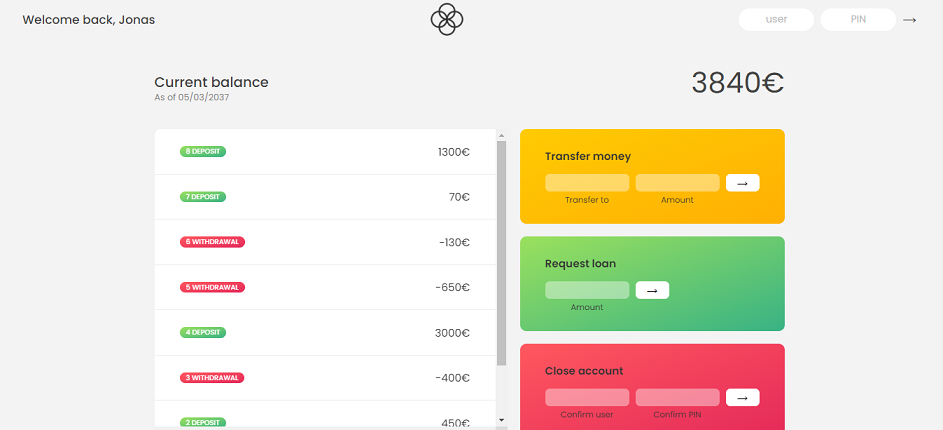

# About
Aplicativo web feito durante o curso [The Complete JavaScript Course](https://www.udemy.com/course/the-complete-javascript-course/)

A aplicação consiste em um simulador de uma conta bancária

## Overview

### Screenshot

### Links

- Project link: (https://alan589.github.io/bankist/) Fake "log in" with user `js` and PIN `1111`

## My process

### Built with

- HTML
- CSS
- JavaScript

### What I learned

- Dates
- Timers
- Intl API

## Author

- Linkedin - [Alan cavalcante](https://www.linkedin.com/in/alan-cavalcante-382051206/)

